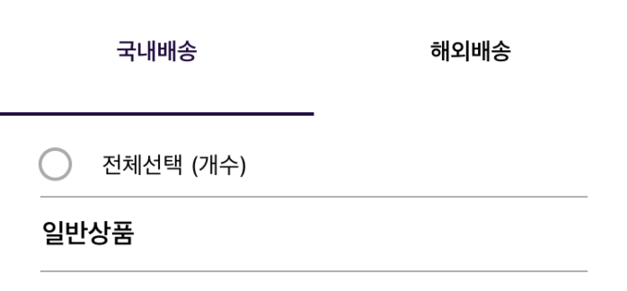
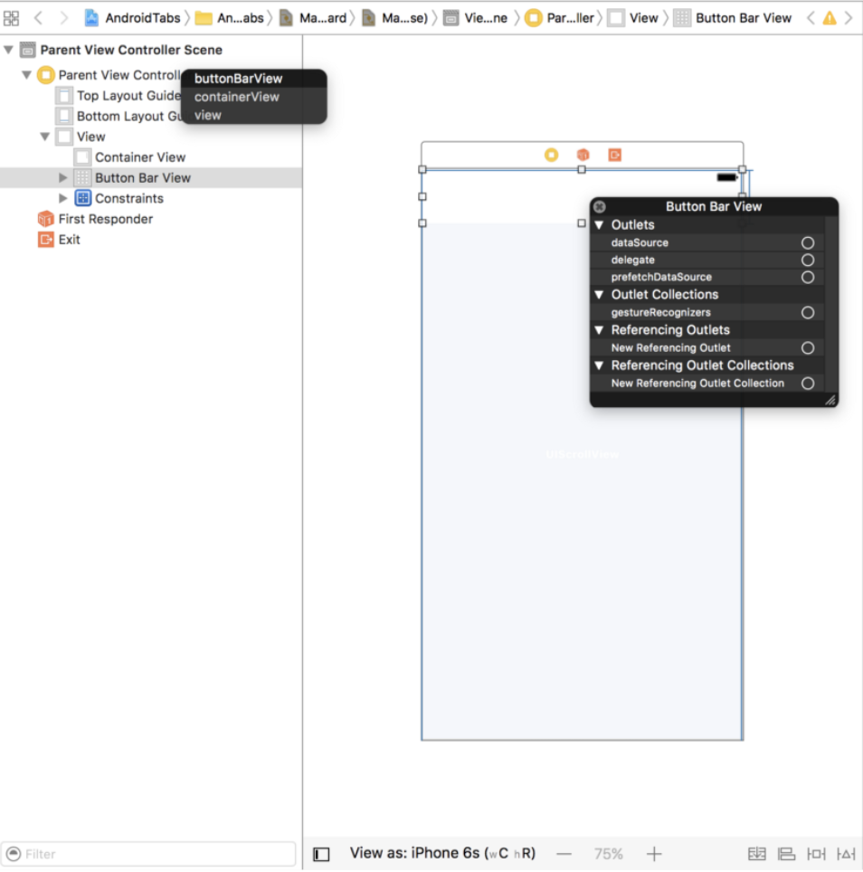
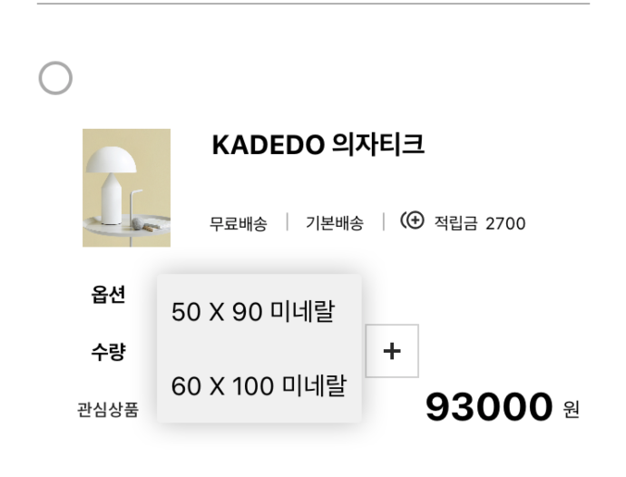

이윤진

 💻 코드 간단 정리

---
**1주차 과제**

**✨ Navigation Controller 응용**

👉네비게이션 컨트롤러는 스택처럼 쌓아올린다는 구조

👉 버튼을 push로 연결


✨ **로그인 화면 구현**

 

👉 로그인화면/로그인화면/회원가입화면으로 구성

> 회원가입 화면은 네비게이션 컨트롤러로 연결
> 로그인 - 로그아웃 과정은 버튼 연결로 구현

```swift
guard let receiveViewController = self.storyboard?.instantiateViewController(identifier: "loginViewController") as? LoginViewController else {return}
// storyboard id 설정 후, identifier 지정해주기
			receiveViewController.modalPresentationStyle = .fullScreen
      receiveViewController.id = idTextField.text 
      receiveViewController.pw = pwTextField.text
      
      self.present(receiveViewController, animated: true, completion: {
          if let navController = self.navigationController {
             navController.popViewController(animated: true)
    }
})
```

👉 회원가입 화면 코드

> navigationController에 접근하여 popViewController(animated : true) 통해 로그아웃 후에 맨 처음 화면으로 돌아갈 수 있게 설정

------

**2주차 과제**

✨계산기 구현하기


> vertical stack view를 먼저 깔아주고 그 내부에 horizontal stack view 4개 설치. horizontal stack view 하나 당 버튼 4개 설치해주기
>
> 두 stack view 모두 fill equally로 설정하였고, 간격은 동일하게 10만큼


✨ 버튼 둥글게 만들기

👉 각 버튼 outlet 생성하여 viewController.swift에 연결

```swift
btn0.layer.cornerRadius = 0.5*btn0.bounds.size.width //btn0은 내가 지정한 @IBOutlet
```

👉 버튼이 둥글게 만들어지려면 일단 버튼 모양 자체가 정사각형이어야함. 그래야 온전한 동그라미로 화면에 띄워지게됨(정사각형 아니면 요상한 잎사귀 모양 나옴). 그럼 버튼의 width와 heigth을 동일하게 맞춰줘야하는데...

> sol) 버튼 크기 하나에만 aspect ratio 1:1 값 주기 
>
> vertical stack view와 horizontal stack view 모두 fill equally로 설정해서 크기가 맞춰지게 된다*/


----------------

**3주차 과제**

     


✨ 설정 버튼 눌렀을 때 // actionSheet 구현하는법

```swift
   @IBAction func setList(_ sender: UIButton) {
     let settingAlert = UIAlertController(title: nil, message:nil , preferredStyle: .actionSheet)
        
     let firstAction = UIAlertAction(title: "친구 관리", style: .default, handler: nil)
        
     let secondAction = UIAlertAction(title: "전체 설정", style: .default, handler: nil)
        
     let cancelAction = UIAlertAction(title: "취소", style: .cancel, handler: nil)
        
        settingAlert.addAction(firstAction)
        settingAlert.addAction(secondAction)
        settingAlert.addAction(cancelAction)
        present(settingAlert,animated: true,completion: nil)

}
```

> 굳이 handler의 값을 설정안해줘도 잘 작동
>
> 이번 과제는 action sheet 구현만 하고 sheet 선택 이후의 이벤트는 따로 설정하지 않았기 때문에 굳이 handler가 필요하지 않았음.
>
> 여기서 handler란, sheet 선택 후 이벤트 설정값 받는 변수

```swift
let setFriend = UIAlertAction(title: "친구 관리", style: .default)
let setAll = UIAlertAction(title: "전체 설정", style: .default)
let cancel = UIAlertAction(title: "취소", style: .cancel)

```

✨ 도전과제 // 테이블 뷰 셀 밀어서 삭제하기

> (출처:  https://dev-dream-world.tistory.com/49 ,  https://www.ioscreator.com/tutorials/action-sheet-ios-tutorial)

```swift
func tableView(_ tableView: UITableView, commit editingStyle: UITableViewCell.EditingStyle, forRowAt indexPath: IndexPath){if editingStyle == .delete{
  friendInformations.remove(at: indexPath.row)
  tableView.deleteRows(at: [indexPath], with: .bottom)
   }
 }
```

✨ storyboard id 이용한 Controller 호출 // 이번 과제에서는 Tab Bar Controller 호출하기


```swift
@IBAction func moveTab(_ sender: UIButton) { // 2주차 과제의 메인화면 로그인 버튼 Action 연결
let storyboard = UIStoryboard(name: "Main", bundle: nil)
let nextViewController = storyboard.instantiateViewController(withIdentifier: "Tab") as! TabController // main.storyboard의 지정된 identfier가진 뷰컨트롤러로 전환시켜준다.
nextViewController.modalPresentationStyle = .fullScreen // 탭바 연결된 다른 뷰컨트롤러들 풀사이즈로 보여주기
self.present(nextViewController, animated: true, completion: nil)
}
```

> Tab Controller에 "TabController" 이름의 Swift 클래스 파일 연결 및 storyboard id를 Tab으로 지정
>
> 여기서 중요한 건 modalpresentationStyle = .fullScreen으로 지정해줘야 화면 꽉 찬 형태로 나타나게 된다.

✨ Tab Controller icon customize


👉 Bar Item 메뉴의 image : 탭 바 선택하지 않았을 때 모습 / Tab Bar Item 메뉴의 **selected** image : 탭 바 선택했을 때 어떤 아이콘으로 변경시켜줄 것인지 아이콘 따로 설정하기

~~// 이거 따로 지정해줬어야했다..난 바보야~~


👉 일단 홈 아이콘 - 친구 아이콘 두 개로 설정함. 홈 아이콘은 zeplin 이미지, 친구 아이콘은 xcode 기본 아이콘

> 홈 아이콘 이미지가 나타나지 않는 오류 역시나 발생,  뷰 전환으로 생성한 TabController에 코드 작성하기
>
> 출처 : https://stackoverflow.com/questions/45449589/unable-to-show-icon-in-tab-bar-ios-swift

```swift
/*탭 바 첫 번째 아이콘 홈 아이콘 설정 코드*/
 let arrayOfImageNameForSelectedState = ["homeSelectedIc"]
 let arrayOfImageNameForUnselectedState = ["homeUnselectedIc"]
 if let count = self.tabBar.items?.count {

   for i in 0...(count-2) { // 홈 아이콘만 외부 이미지 가져와서 사용하므로 홈 탭에만 해당하도록 for문 설정하였음
     let imageNameForSelectedState   = arrayOfImageNameForSelectedState[i]
     let imageNameForUnselectedState = arrayOfImageNameForUnselectedState[i]
     self.tabBar.items?[i].selectedImage = UIImage(named: imageNameForSelectedState)?.withRenderingMode(.alwaysOriginal)
     self.tabBar.items?[i].image = UIImage(named: imageNameForUnselectedState)?.withRenderingMode(.alwaysOriginal)
 }
}
```

👉 선택 및 해제 상태 변화

> 출처 : https://stackoverflow.com/questions/31117069/changing-tab-bar-item-image-and-text-color-ios/50222727

```swift
// tabBarItem.badgeValue = "123" , 어플 옆에 알림 몇갠지 보여주는 배지 설정
let selectedColor = UIColor(red: 47.0/255.0, green: 54.0/255.0, blue: 62.0/255.0, alpha: 1.0)
let unselectedColor = UIColor(red: 0.0/255.0, green: 0.0/255.0, blue: 0.0/255.0, alpha: 1.0) // 탭 바 text 색깔 지정하기
UITabBarItem.appearance().setTitleTextAttributes([NSAttributedString.Key.foregroundColor: unselectedColor], for: .normal)      UITabBarItem.appearance().setTitleTextAttributes([NSAttributedString.Key.foregroundColor: selectedColor], for: .selected)
```

> 그럼 여기서 나타나는 문제가 기본 아이콘을 사용하는 친구 탭 아이콘 색깔은 바뀌지 않는다는 것임, 그래서 우리는 Appdelegate파일로 이동해서 추가적으로 색상을 변경해주는 코드를 작성해야한다

👉 Appdelegate 파일에 추가적으로 코드 작성해주기

출처 : https://www.peterwitham.com/swift-archives/how-to-change-the-ios-tab-bar-colors/

```swift
func application(_ application: UIApplication, didFinishLaunchingWithOptions launchOptions: [UIApplication.LaunchOptionsKey: Any]?) -> Bool {
// Override point for customization after application launch.
UITabBar.appearance().tintColor = UIColor(red: 47.0/255.0, green: 54.0/255.0, blue: 62.0/255.0, alpha: 1.0)
// 친구 아이콘의 이미지 색상 회색으로 바뀌도록 값 지정함
return true}
```

------

**4주차 과제**

 ✨**회원 가입 구현하기 및 자동로그인 과제#1**

👉 회원가입 struct - SignupData

```swift
struct SignupData: Codable { // encode, decode 둘 다 가능하게 한다.
    var status: Int
    var success: Bool
    var message: String
  /*추가적인 코드는 생략했음*/
}
```

>status(200, 204, 400...etc), true, 회원가입 성공 데이터가 필요.  데이터 파일 변수 3개 지정해서 구성했음
>
>회원가입은 서버로부터 값 전달받는 건 없으므로 토큰 지정해줄 필요는 없다

👉 SignupService.swift

```swift
private func makeParameter(_ id: String, _ pwd: String, _ name: String, _ email: String, _ phone: String) -> Parameters {
        return ["id": id, "password": pwd, "name": name, "email": email, "phone": phone]
}
// 회원가입 구현부
func signup(id: String, pwd: String,name: String, email: String, phone: String, completion: @escaping (NetworkResult<Any>) -> Void) {
        let header: HTTPHeaders = ["Content-Type": "application/json"] 
  			// HTTP Header 객체, alamofire에 구현되어있는 reference변수이자 request header 생성
        let dataRequest = Alamofire.request(APIConstants.signupURL, method: .post, parameters: makeParameter(id, pwd,name, email,phone), encoding:JSONEncoding.default, headers: header)
```

>회원가입 시에는 추가적으로 이름, 이메일 정보, 전화 번호가 필요하므로 parameter 더 추가함

```swift
private func isSignup(by data: Data) -> NetworkResult<Any> {
	let decoder = JSONDecoder()
	guard let decodedData = try? decoder.decode(SignupData.self, from: data) else { return .pathErr }
	if decodedData.success {
		print("\(decodedData)")
    print(decodedData)
    return .success(data)
  }
   return .requestErr(decodedData.message)
}
```

> 데이터 전송 성공시 실행된다 (case 200). JSonDecoder()로 디코딩 실행 후, DecodedData.success시에 decodedData 값 출력해서 현재 서버 연결 상태 확인가능

> 추가적으로, decode(signupData.self,) -> 저 부분에다가 데이터 struct 값 넣는건데..~~signInData.self 안 고쳐줘서 이틀을 날렸다~~...잘못 연결해주면 회원가입인데 api 연결 확인 시(코드 내부의 decodedData 출력하는 부분)로그인 성공이 뜨는 완전히 다 꼬여버리는 불상사 발생,,,제발 눈을 뜨세요

👉 signupVC.swift

```swift
SignupService.shared.signup(id: signUserid, pwd: signPwd, name: signName, email: signEmail, phone: signPhone) { networkResult in                                                                                                      	switch networkResult {
		case .success(_): // 데이터 전송 성공
			guard let receiveViewController = self.storyboard?.instantiateViewController(identifier: "mainViewController") as? MainViewController else {return}
			receiveViewController.modalPresentationStyle = .fullScreen
			self.present(receiveViewController, animated: true, completion: nil)
			receiveViewController.idTextField.text = signUserid
			receiveViewController.pwTextField.text = signPwd // 여기까지만 작성하면 회원가입 기본 과제 완료
  		receiveViewController.AutoLogin() 
```

> 회원가입 완료 버튼 눌렀을때(@IBAction) 작동하는 코드
>
> VC identifierfer를 지정해줘서 데이터 전송 성공했을 경우 지정된 identifier의 VC(로그인화면 뷰 컨트롤러)의 idTextfield와 pwTextfield에 값 전송해준다. 
>
> 여기까지 성공적으로 진행되면 로그인화면에 회원가입 한 아이디 정보와 비밀번호 정보가 출력된다

> 추가적으로 회원가입 시 자동로그인을 구현하기 위해 로그인화면에 AutoLogin함수를 선언하여 호출하도록 설정함!

👉 mainViewController의 AutoLogin()

~~원래 SignupService 파일에 Tab VC까지 전환하는 코드 넣었는데 안 넘어가서 급하게 함수 만들었음  단박에 문제 해결한 갓윤재에게 박수를~~

```swift
 func AutoLogin(){
        guard let inputID = idTextField.text else { return }
        guard let inputPWD = pwTextField.text else { return }
        
        LoginService.shared.login(id: inputID, pwd: inputPWD) { networkResult in
            switch networkResult {
            case .success(let token):
                guard let token = token as? String else { return }
                UserDefaults.standard.set(token, forKey: "token")
                guard let tabbarController = self.storyboard?.instantiateViewController(identifier:
                    "Tab") as? UITabBarController else { return }
                tabbarController.modalPresentationStyle = .fullScreen
                self.present(tabbarController, animated: true, completion: nil)
            case .requestErr(let message):
                guard let message = message as? String else { return }
                let alertViewController = UIAlertController(title: "로그인 실패", message: message, preferredStyle: .alert)
                let action = UIAlertAction(title: "확인", style: .cancel, handler: nil)
                alertViewController.addAction(action)
                self.present(alertViewController, animated: true, completion: nil)
            case .pathErr: print("path")
            case .serverErr: print("serverErr") case .networkFail: print("networkFail")
            }
        }
    }
```

> 회원가입 성공 시, 로그인 화면에서 자동으로 Tab 컨트롤러 연결된 VC로 전환되어야 하는데, 로그인 VC에 Tab Controller로 전환될 수 있도록 코드를 작성했음 // 로그인 구현 할 때 사용했던 코드임
>
> 회원가입 성공하면, 로그인 구현 시 사용한 LoginService를 통해 서버 연결 성공하면 Tab 컨트롤러 전환되도록 만들었다

> <u>근데 왜 회원가입 VC에서는 로그인 화면까지 값 전달은 잘 됐는데 왜 탭바로 안 넘어가졌는지 아직도 의문임</u>

------

**5주차 과제 / 6주차 과제**

✨ 장바구니 화면 - pager controller




> 한 화면에 두 개 이상의 뷰를 스와이프 동작으로 전환 가능하게 만들어준다. 시중에 출시된 많은 앱들이 사용하는 화면 구성이지만 외부에서 제공하는 라이브러리 설치해서 사용해야한다(코코아팟)
>
>  파트장님이 알려주신 라이브러리 :  https://github.com/xmartlabs/XLPagerTabStrip
>
> 위 깃헙의 리드미 파일에 튜토리얼로 올려놓은 사이트 : https://medium.com/michaeladeyeri/how-to-implement-android-like-tab-layouts-in-ios-using-swift-3-578516c3aa9

👉 XLPagerStrip 

> 페이지 컨트롤 애니메이션과 메뉴바 디자인을 담당하는 부모 뷰 한 개(parent), 컨텐츠를 담고 있는 자식 뷰 여러 개(child)로 구성되어있다.  부모 뷰가 여러 자식뷰들의 지정된 identfier를 호출하여 화면에 보여주는 방식이라고 볼 수 있겠다.

👉 step1. parentViewController

```swift
    settings.style.buttonBarBackgroundColor = .white
            settings.style.buttonBarItemBackgroundColor = .white
            settings.style.selectedBarBackgroundColor = purpleInspireColor
            settings.style.buttonBarItemFont = .boldSystemFont(ofSize: 14)
            settings.style.selectedBarHeight = 2.0
            settings.style.buttonBarMinimumLineSpacing = 0
            settings.style.buttonBarItemTitleColor = .black
            settings.style.buttonBarItemsShouldFillAvailableWidth = true
            settings.style.buttonBarLeftContentInset = 0
            settings.style.buttonBarRightContentInset = 0
            changeCurrentIndexProgressive = { [weak self] (oldCell: ButtonBarViewCell?, newCell: ButtonBarViewCell?, progressPercentage: CGFloat, changeCurrentIndex: Bool, animated: Bool) -> Void in
            guard changeCurrentIndex == true else { return }
            oldCell?.label.textColor = .black
            newCell?.label.textColor = self?.purpleInspireColor
            }
```

> 부모 뷰의 viewDidLoad()에 넣어줘야할 코드. 메뉴 사이즈 및 색상을 지정해준다.



> 메뉴를 구성하기 위해서 상단에 스크롤뷰를 놓고, 그 내부에 자식 뷰들의 전환이 일어날 수 있도록 컬렉션뷰를 넣어준다.(이미지참고. 더 자세한 constraint값 조정사항은 위에 걸어놓은 튜토리얼 링크 참고)

👉 step2. childViewController _ 내 프로젝트 기준으로는 child1(국내배송), child2(해외배송)로 지정

```swift
class child2ViewController: UIViewController, IndicatorInfoProvider{
        
        override func viewDidLoad() {
            super.viewDidLoad()
        }
        
        override func didReceiveMemoryWarning() {
            super.didReceiveMemoryWarning()
        }
        
        func indicatorInfo(for pagerTabStripController: PagerTabStripViewController) -> IndicatorInfo {
            return IndicatorInfo(title: "해외배송")
        }
    }

```

> 자식 뷰에는 XLPagerTabStrip을 import한 뒤, 클래스 내부에 viewDidLoad(), didReceiveMemoryWarning(), indicatorInfo() 함수를 써준다.
>
> indicatorInfo() 함수 내부 return 부분이 바로 우리가 메뉴 이름으로 띄울 내용이 되는 것. 여기서 지정해준 title이 바로 메뉴에 나타나는 이름이 된다.

👉 step3. parentViewController에 이어서 코드 작성

```swift
override func viewControllers(for pagerTabStripController: PagerTabStripViewController) -> [UIViewController] {
let child_1 = UIStoryboard(name: "Main", bundle: nil).instantiateViewController(withIdentifier: "child1")
let child_2 = UIStoryboard(name: "Main", bundle: nil).instantiateViewController(withIdentifier: "child2")
return [child_1, child_2]
}
```

> 자식 뷰들을 호출해와서 한 화면에 보여주기 위해 필요한 코드. 자식ViewController별로 지정된 identifer를 사용하여 호출한다.

✨ drop down menu bar



> DropDown 라이브러리 import 해오기

```swift
var dropDown:DropDown?
'''skip'''
override func awakeFromNib() {
        super.awakeFromNib()
        dropDown = DropDown()
        dropDown?.anchorView = button
        dropDown?.dataSource = ["50 X 90 미네랄", "60 X 100 미네랄"]
        button.addTarget(self, action: #selector(dropDownButton), for: .touchUpInside)
        dropDown?.selectionAction = { [unowned self] (index: Int, item: String) in self.button.setTitle(item, for: .normal)
        }
// Initialization code 
}
```

> dataSource _ 선택할 옵션 뭐 들어갈건지 넣어주기
>
> selectAction _ 드롭다운 선택 후 해당 아이템 선택하면 선택한 아이템 문자열이 그대로 버튼 타이틀에 나타나게 된다.

✨ 서버통신 GET

> 지난번 세미나에서 진행한 회원가입과 로그인 실습 과제는 POST방식이었으나 이번주 서버 협동 세미나에서는 GET방식으로 진행하였다! 

```swift
struct basketService{
    
   static let shared = basketService()
       
       func getBasketService(completion:@escaping (NetworkResult<Any>) -> Void){
   //        var bannerList : [BannerInfo] = []
           let header: HTTPHeaders = ["Content-Type":"application/json"]
           let dataRequest = Alamofire.request(APIConstants.shoppingbagURL,method: .get,parameters:nil,encoding: JSONEncoding.default, headers: header)
           dataRequest.responseData { dataResponse in
               switch dataResponse.result {
               case .success:
                   guard let statusCode = dataResponse.response?.statusCode else { return}
                   print(statusCode)
                   guard let value = dataResponse.result.value else {return}
                   let networkResult = self.judge(by: statusCode, value)
                   completion(networkResult)
               case .failure: completion(.serverErr)
               }
           }
           
       }
       private func judge(by statusCode:Int,_ data:Data) -> NetworkResult<Any>{
           switch statusCode {
           case 200: return decodingCart(by: data)
           default: return .serverErr
           }
       }
       private func decodingCart(by data:Data)->NetworkResult<Any>{
           let decoder = JSONDecoder()
           guard let decodedData = try? decoder.decode(Basket.self,from: data) else {//print("?")
               return .serverErr}
           guard let itemInfo = decodedData.data else {
               //print("여기")
               return .requestErr(decodedData.message)}
        return .success(itemInfo.result1)
       }
    
    
}

```

> decodingCart()가 본격적으로 서버 연결 성공하면 데이터 받아오게되는 함수. 

```swift
private var cartItems: [Delivery] = []
'''생략'''
basketService.shared.getBasketService(){ networkResult in
                switch networkResult {
               
                    
                case .success(let basket):
                     guard let basket = basket as? [Delivery] else {return}
                     //print(basket)
                     self.cartItems = basket
                     print(self.cartItems)
                     DispatchQueue.main.async {
                        self.itemTableView.reloadData()
                    }
                     self.itemTableView.reloadData() // 이렇게 reloadData()다시!
                    
                case .requestErr(let message):
                    guard let message = message as? String else {return}
                    print(message)
                
                case .serverErr:
                    print("serverErr")
             
                }
```

> ❗️case .success인데 왜 내 테이블뷰에는 데이터가 넘어오지 않을까...
>
> 엑코를 실행하면 테이블뷰를 포함한 뷰를 띄우는 동시에 네트워크 통신도 동시에 시작! 
>
> 여기서 내가 만들어놓은 뷰가 시뮬레이터에 뜨는 시간보다 서버에서 데이터 받아오는데 시간이 좀 더 소요되기 때문에 내 시뮬레이터에는 통신 전 비어있는 셀 값이 뜨게 되는 것
>
> 따라서 네트워크 통신이 끝나고 테이블 뷰 셀 데이터를 다시 업데이트 시켜줘야함!

✨ Kingfisher

```swift
import Foundation
import UIKit
import Kingfisher
// Kingfisher를 이용하여 url로부터 이미지를 가져오는 extension
extension UIImageView {
    public func imageFromUrl(_ urlString: String?, defaultImgPath : String) {
        let defaultImg = UIImage(named: defaultImgPath)
        if let url = urlString {
            if url.isEmpty {
                self.image = defaultImg
            } else {
                self.kf.setImage(with: URL(string: url), placeholder: defaultImg, options: [.transition(ImageTransition.fade(0.5))])
            }
        } else {
            self.image = defaultImg
        }
    }
}

```

> 이미지 캐싱하는 kingfisher사용하여 extension파일 만들기
>
> imageFromurl() 함수 사용하여 이미지url을 통해 이미지 띄워놓기
>
> defaultImgPath는 이미지 띄워지기 전의 기본 이미지 설정해주는 것