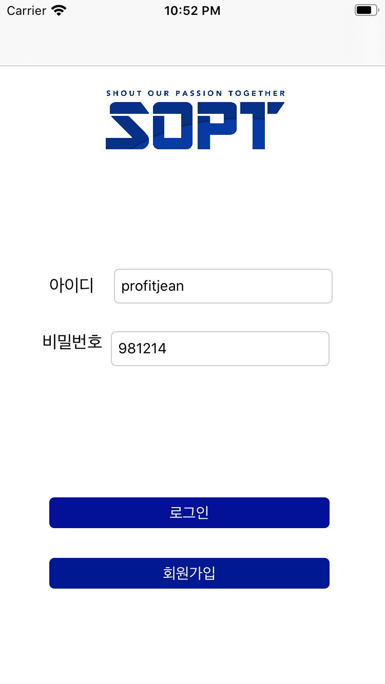

# LeeYoonJin
이윤진

 💻 코드 간단 정리

---
* **1주차 과제**

  **✨ Navigation Controller 응용**

  👉네비게이션 컨트롤러는 스택처럼 쌓아올린다는 구조~~

  👉 버튼을 push로 연결

  

  ✨ **로그인 화면 구현**

   

  

  

  👉 로그인화면/로그인화면/회원가입화면으로 구성

  * 회원가입 화면은 네비게이션 컨트롤러로 연결
  * 로그인 - 로그아웃 과정은 버튼 연결로 구현

  ```swift
  guard let receiveViewController = self.storyboard?.instantiateViewController(identifier: "loginViewController") as? LoginViewController else {return}
  // storyboard id 설정 후, identifier 지정해주기
  			receiveViewController.modalPresentationStyle = .fullScreen
        receiveViewController.id = idTextField.text 
        receiveViewController.pw = pwTextField.text
        
        self.present(receiveViewController, animated: true, completion: {
            if let navController = self.navigationController {
               navController.popViewController(animated: true)
      }
  })
  ```

  👉 회원가입 화면 코드

  * navigationController에 접근하여 popViewController(animated : true) 통해 로그아웃 후에 맨 처음 화면으로 돌아갈 수 있게 설정

  

