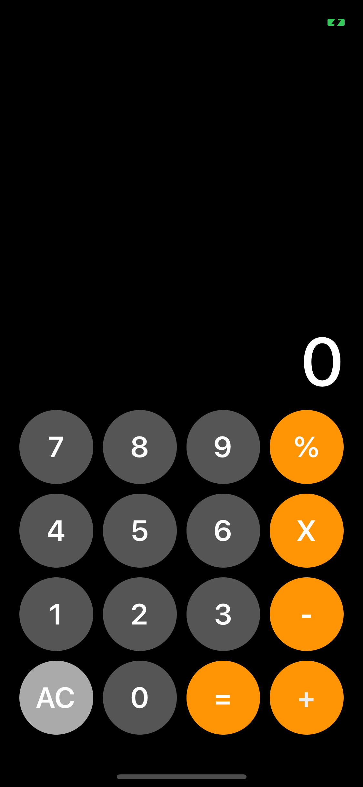
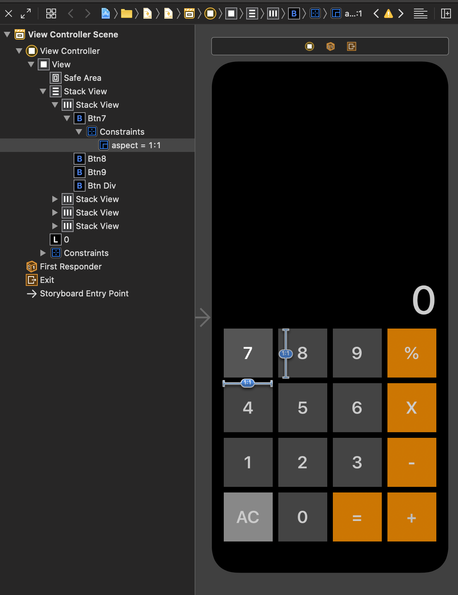
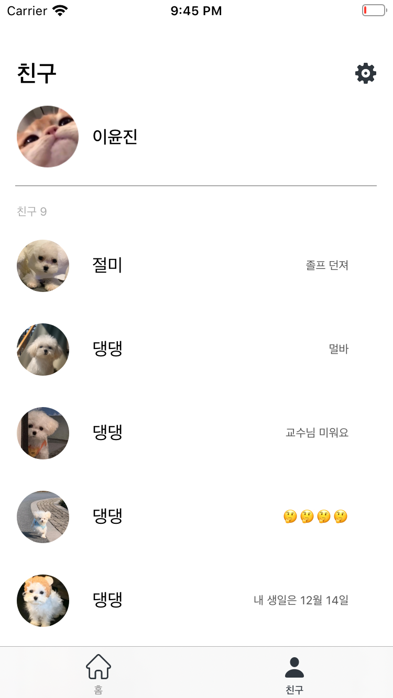
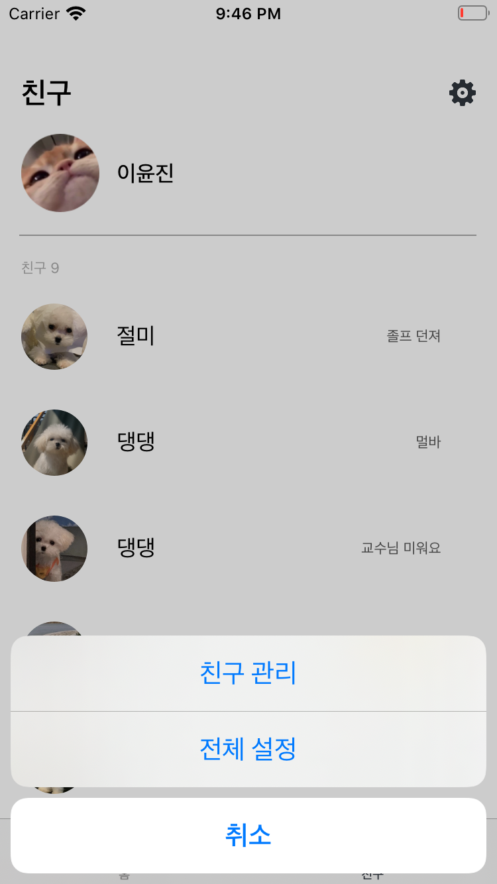
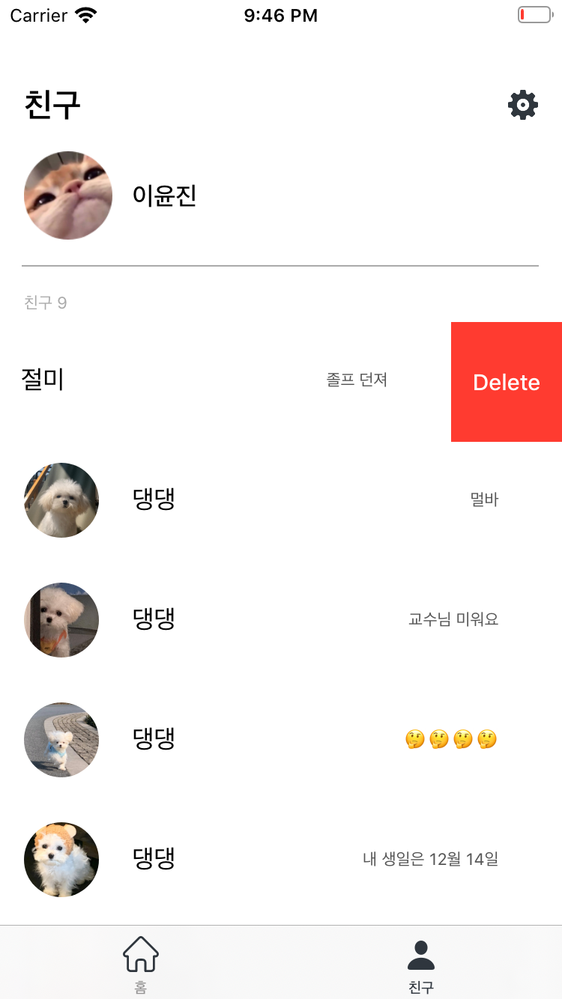
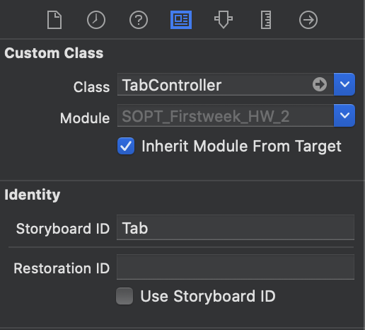
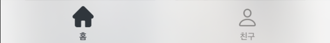

이윤진

 💻 코드 간단 정리

---
* **1주차 과제**

  **✨ Navigation Controller 응용**

  👉네비게이션 컨트롤러는 스택처럼 쌓아올린다는 구조

  👉 버튼을 push로 연결

  

  ✨ **로그인 화면 구현**

   

  👉 로그인화면/로그인화면/회원가입화면으로 구성

  * 회원가입 화면은 네비게이션 컨트롤러로 연결
  * 로그인 - 로그아웃 과정은 버튼 연결로 구현

  ```swift
  guard let receiveViewController = self.storyboard?.instantiateViewController(identifier: "loginViewController") as? LoginViewController else {return}
  // storyboard id 설정 후, identifier 지정해주기
  			receiveViewController.modalPresentationStyle = .fullScreen
        receiveViewController.id = idTextField.text 
        receiveViewController.pw = pwTextField.text
        
        self.present(receiveViewController, animated: true, completion: {
            if let navController = self.navigationController {
               navController.popViewController(animated: true)
      }
  })
  ```

  👉 회원가입 화면 코드

  * navigationController에 접근하여 popViewController(animated : true) 통해 로그아웃 후에 맨 처음 화면으로 돌아갈 수 있게 설정

------

* **2주차 과제**

  ✨계산기 구현하기

  

  

  👉 vertical stack view를 먼저 깔아주고 그 내부에 horizontal stack view 4개 설치. horizontal stack view 하나 당 버튼 4개 설치했음
  
  👉 두 stack view 모두 fill equally로 설정하였고, 간격은 동일하게 10만큼
  
  
  ✨ 버튼 둥글게 만들기
  
  👉 각 버튼 outlet 생성하여 viewController.swift에 연결
  
  ```swift
  btn0.layer.cornerRadius = 0.5*btn0.bounds.size.width //btn0은 내가 지정한 @IBOutlet
  ```
  
  👉 버튼이 둥글게 만들어지려면 일단 버튼 모양 자체가 정사각형이어야함. 그래야 온전한 동그라미로 화면에 띄워지게됨(정사각형 아니면 요상한 잎사귀 모양 나옴). 그럼 버튼의 width와 heigth을 동일하게 맞춰줘야하는데...
  
  ​	// sol) 버튼 크기 하나에만 aspect ratio 1:1 값 주기 
  
  /* vertical stack view와 horizontal stack view 모두 fill equally로 설정해서 크기가 맞춰지게 된다*/
  
  

----------------

* **3주차 과제**

        

  

  ✨ 설정 버튼 눌렀을 때 // actionSheet 구현하는법

  ```swift
     @IBAction func setList(_ sender: UIButton) {
       let settingAlert = UIAlertController(title: nil, message:nil , preferredStyle: .actionSheet)
          
       let firstAction = UIAlertAction(title: "친구 관리", style: .default, handler: nil)
          
       let secondAction = UIAlertAction(title: "전체 설정", style: .default, handler: nil)
          
       let cancelAction = UIAlertAction(title: "취소", style: .cancel, handler: nil)
          
          settingAlert.addAction(firstAction)
          settingAlert.addAction(secondAction)
          settingAlert.addAction(cancelAction)
          present(settingAlert,animated: true,completion: nil)
  
  }
  ```

  👉 굳이 handler의 값을 설정안해줘도 잘 작동

  // 이번 과제는 action sheet 구현만 하고 sheet 선택 이후의 이벤트는 따로 설정하지 않았기 때문에 굳이 handler가 필요하지 않았음.

  // 여기서 handler란, sheet 선택 후 이벤트 설정값 받는 변수

  ```swift
  let setFriend = UIAlertAction(title: "친구 관리", style: .default)
  let setAll = UIAlertAction(title: "전체 설정", style: .default)
  let cancel = UIAlertAction(title: "취소", style: .cancel)
  
  ```

  ✨ 도전과제 // 테이블 뷰 셀 밀어서 삭제하기 (출처:  https://dev-dream-world.tistory.com/49 ,  https://www.ioscreator.com/tutorials/action-sheet-ios-tutorial)

  ```swift
  func tableView(_ tableView: UITableView, commit editingStyle: UITableViewCell.EditingStyle, forRowAt indexPath: IndexPath){if editingStyle == .delete{
    friendInformations.remove(at: indexPath.row)
    tableView.deleteRows(at: [indexPath], with: .bottom)
     }
   }
  ```

  ✨ storyboard id 이용한 Controller 호출 // 이번 과제에서는 Tab Bar Controller 호출하기

  

  ```swift
  @IBAction func moveTab(_ sender: UIButton) { // 2주차 과제의 메인화면 로그인 버튼 Action 연결
  let storyboard = UIStoryboard(name: "Main", bundle: nil)
  let nextViewController = storyboard.instantiateViewController(withIdentifier: "Tab") as! TabController // main.storyboard의 지정된 identfier가진 뷰컨트롤러로 전환시켜준다.
  nextViewController.modalPresentationStyle = .fullScreen // 탭바 연결된 다른 뷰컨트롤러들 풀사이즈로 보여주기
  self.present(nextViewController, animated: true, completion: nil)
  }
  ```

  👉 Tab Controller에 "TabController" 이름의 Swift 클래스 파일 연결 및 storyboard id를 Tab으로 지정

  // 여기서 중요한 건 modalpresentationStyle = .fullScreen으로 지정해줘야 화면 꽉 찬 형태로 나타나게 된다.

  ✨ Tab Controller icon customize

  

  👉 Bar Item 메뉴의 image : 탭 바 선택하지 않았을 때 모습 / Tab Bar Item 메뉴의 **selected** image : 탭 바 선택했을 때 어떤 아이콘으로 변경시켜줄 것인지 아이콘 따로 설정하기

  ~~// 이거 따로 지정해줬어야했다..난 바보야~~

  

  👉 일단 홈 아이콘 - 친구 아이콘 두 개로 설정함. 홈 아이콘은 zeplin 이미지, 친구 아이콘은 xcode 기본 아이콘

  * 홈 아이콘 이미지가 나타나지 않는 오류 역시나 발생,  뷰 전환으로 생성한 TabController에 코드 작성하기

    출처 : https://stackoverflow.com/questions/45449589/unable-to-show-icon-in-tab-bar-ios-swift

    ```swift
    /*탭 바 첫 번째 아이콘 홈 아이콘 설정 코드*/
     let arrayOfImageNameForSelectedState = ["homeSelectedIc"]
     let arrayOfImageNameForUnselectedState = ["homeUnselectedIc"]
     if let count = self.tabBar.items?.count {
    
       for i in 0...(count-2) { // 홈 아이콘만 외부 이미지 가져와서 사용하므로 홈 탭에만 해당하도록 for문 설정하였음
         let imageNameForSelectedState   = arrayOfImageNameForSelectedState[i]
         let imageNameForUnselectedState = arrayOfImageNameForUnselectedState[i]
         self.tabBar.items?[i].selectedImage = UIImage(named: imageNameForSelectedState)?.withRenderingMode(.alwaysOriginal)
         self.tabBar.items?[i].image = UIImage(named: imageNameForUnselectedState)?.withRenderingMode(.alwaysOriginal)
     }
    }
    ```

  * 선택/선택 해제 시 색깔 새롭게 지정
    출처 : https://stackoverflow.com/questions/31117069/changing-tab-bar-item-image-and-text-color-ios/50222727

    ```swift
    // tabBarItem.badgeValue = "123" , 어플 옆에 알림 몇갠지 보여주는 배지 설정
    let selectedColor = UIColor(red: 47.0/255.0, green: 54.0/255.0, blue: 62.0/255.0, alpha: 1.0)
    let unselectedColor = UIColor(red: 0.0/255.0, green: 0.0/255.0, blue: 0.0/255.0, alpha: 1.0) // 탭 바 text 색깔 지정하기
    UITabBarItem.appearance().setTitleTextAttributes([NSAttributedString.Key.foregroundColor: unselectedColor], for: .normal)      UITabBarItem.appearance().setTitleTextAttributes([NSAttributedString.Key.foregroundColor: selectedColor], for: .selected)
    ```

    // 그럼 여기서 나타나는 문제가 기본 아이콘을 사용하는 친구 탭 아이콘 색깔은 바뀌지 않는다는 것임, 그래서 우리는 Appdelegate파일로 이동해서 추가적으로 색상을 변경해주는 코드를 작성해야한다

  * Appdelegate 파일에 추가적으로 코드 작성해주기
    출처 : https://www.peterwitham.com/swift-archives/how-to-change-the-ios-tab-bar-colors/

    ```swift
    func application(_ application: UIApplication, didFinishLaunchingWithOptions launchOptions: [UIApplication.LaunchOptionsKey: Any]?) -> Bool {
    // Override point for customization after application launch.
    UITabBar.appearance().tintColor = UIColor(red: 47.0/255.0, green: 54.0/255.0, blue: 62.0/255.0, alpha: 1.0)
    // 친구 아이콘의 이미지 색상 회색으로 바뀌도록 값 지정함
    return true}
    ```

    